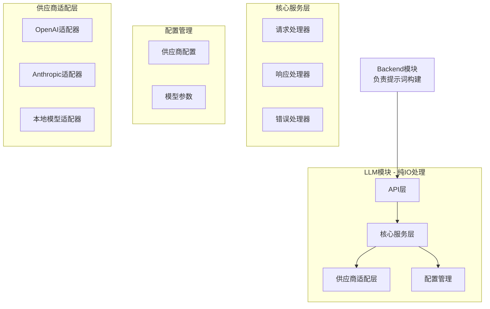

# LLM模块技术规格说明

## 1. 模块概述

### 1.1 设计目标
LLM模块作为独立的微服务，专门负责大语言模型的输入输出处理。该模块严格遵循极简主义设计原则，仅提供纯粹的LLM IO能力，不涉及任何业务逻辑或提示词生成。

### 1.2 核心原则
- **极简主义**：只保留必要的IO功能，避免过度工程化
- **单一职责**：仅负责LLM模型的输入输出处理
- **完全受控**：只接受backend模块的调用，不对外暴露
- **职责边界清晰**：不负责提示词生成，由backend模块提供完整提示词

### 1.3 技术栈选择
- **框架**：Flask 2.3.3（轻量级，符合极简原则）
- **HTTP客户端**：httpx 0.24.1（支持异步请求）
- **配置管理**：PyYAML 6.0.1（支持YAML/JSON）
- **日志**：Python内置logging模块
- **部署**：Docker容器化部署

## 2. 系统架构设计

### 2.1 整体架构


### 2.2 职责边界
- **LLM模块负责**：
  - 接收已构建的完整提示词
  - 调用供应商API
  - 处理原始响应
  - 错误处理和重试
  - 供应商切换和负载均衡

- **Backend模块负责**：
  - 业务逻辑处理
  - 提示词构建和模板管理
  - 用户交互
  - 数据持久化
  - 结果后处理

### 2.3 目录结构
```
llm-service/
├── app.py                     # Flask应用入口
├── config/
│   ├── __init__.py
│   └── provider_config.json   # 供应商配置
├── service/
│   ├── __init__.py
│   ├── llm_service.py         # LLM IO核心服务
│   └── response_service.py    # 响应处理服务
├── adapter/
│   ├── __init__.py
│   ├── base_adapter.py        # 基础适配器
│   ├── openai_adapter.py      # OpenAI适配器
│   ├── anthropic_adapter.py   # Anthropic适配器
│   └── local_adapter.py       # 本地模型适配器
├── model/
│   ├── __init__.py
│   ├── request.py             # 请求模型
│   └── response.py            # 响应模型
├── utils/
│   ├── __init__.py
│   ├── logger.py              # 日志工具
│   └── retry.py               # 重试机制
├── tests/
│   ├── test_service.py
│   └── test_adapter.py
├── Dockerfile
├── requirements.txt
└── README.md
```

## 3. 对外API接口设计

### 3.1 API概述
LLM模块仅对backend模块提供RESTful API接口，所有接口需要通过认证机制保护。

### 3.2 核心API接口

#### 3.2.1 LLM调用接口
```http
POST /api/v1/llm/invoke
Content-Type: application/json
Authorization: Bearer <backend_token>

{
    "provider": "openai",
    "model": "gpt-4",
    "messages": [
        {
            "role": "system",
            "content": "你是一个专业的英语学习助手..."
        },
        {
            "role": "user",
            "content": "请分析以下文章..."
        }
    ],
    "options": {
        "temperature": 0.7,
        "max_tokens": 2000
    }
}
```

响应：
```json
{
    "success": true,
    "data": {
        "content": "AI响应内容",
        "usage": {
            "prompt_tokens": 100,
            "completion_tokens": 200,
            "total_tokens": 300
        },
        "model": "gpt-4",
        "provider": "openai"
    },
    "timestamp": "2024-01-01T12:00:00Z"
}
```

#### 3.2.2 批量调用接口
```http
POST /api/v1/llm/batch
Content-Type: application/json
Authorization: Bearer <backend_token>

{
    "requests": [
        {
            "id": "req_001",
            "provider": "openai",
            "model": "gpt-4",
            "messages": [
                {"role": "system", "content": "..."},
                {"role": "user", "content": "..."}
            ],
            "options": {
                "temperature": 0.7,
                "max_tokens": 2000
            }
        }
    ]
}
```

响应：
```json
{
    "success": true,
    "data": {
        "results": [
            {
                "id": "req_001",
                "success": true,
                "content": "AI响应内容",
                "usage": {...}
            }
        ],
        "total_usage": {
            "prompt_tokens": 300,
            "completion_tokens": 600,
            "total_tokens": 900
        }
    },
    "timestamp": "2024-01-01T12:00:00Z"
}
```

#### 3.2.3 健康检查接口
```http
GET /api/v1/health
```

响应：
```json
{
    "status": "healthy",
    "version": "1.0.0",
    "providers": {
        "openai": "available",
        "anthropic": "available",
        "local": "unavailable"
    }
}
```

### 3.3 错误响应格式
```json
{
    "success": false,
    "error": {
        "code": "PROVIDER_UNAVAILABLE",
        "message": "指定的供应商暂时不可用",
        "details": "OpenAI API返回503错误"
    },
    "timestamp": "2024-01-01T12:00:00Z"
}
```

## 4. 配置管理系统

### 4.1 供应商配置文件 (provider_config.json)
```json
{
    "default_provider": "openai",
    "timeout": 30,
    "retry_attempts": 3,
    "rate_limit": {
        "requests_per_minute": 60,
        "tokens_per_minute": 100000
    },
    "providers": {
        "openai": {
            "name": "OpenAI",
            "base_url": "https://api.openai.com/v1",
            "api_key": "${OPENAI_API_KEY}",
            "models": {
                "gpt-4": {
                    "max_tokens": 4000,
                    "max_context_length": 8192,
                    "cost_per_1k_tokens": 0.03
                },
                "gpt-3.5-turbo": {
                    "max_tokens": 4000,
                    "max_context_length": 16384,
                    "cost_per_1k_tokens": 0.002
                }
            }
        },
        "anthropic": {
            "name": "Anthropic",
            "base_url": "https://api.anthropic.com/v1",
            "api_key": "${ANTHROPIC_API_KEY}",
            "models": {
                "claude-3-sonnet": {
                    "max_tokens": 4000,
                    "max_context_length": 200000,
                    "cost_per_1k_tokens": 0.015
                }
            }
        },
        "local": {
            "name": "Local Model",
            "base_url": "http://localhost:8000/v1",
            "api_key": "local-key",
            "models": {
                "local-model": {
                    "max_tokens": 4000,
                    "max_context_length": 4096,
                    "cost_per_1k_tokens": 0
                }
            }
        }
    }
}
```

### 4.2 配置热更新机制
- 使用文件监控机制（watchdog）监听配置文件变化
- 配置更新时平滑切换，不影响正在处理的请求
- 配置验证机制，确保新配置的合法性

### 4.3 环境变量管理
- 敏感信息（API密钥）通过环境变量注入
- 支持开发、测试、生产环境配置隔离
- 密钥轮换机制

## 5. 核心服务实现

### 5.1 LLM IO服务
```python
class LLMService:
    """LLM输入输出核心服务"""

    def __init__(self, config: Dict):
        self.config = config
        self.adapters = self._init_adapters()
        self.rate_limiter = RateLimiter(config)

    async def invoke(
        self,
        provider: str,
        model: str,
        messages: List[Dict],
        **options
    ) -> Dict:
        """调用LLM模型"""
        adapter = self.get_adapter(provider)

        # 验证消息格式
        self._validate_messages(messages)

        # 应用速率限制
        await self.rate_limiter.acquire()

        # 调用适配器
        response = await adapter.chat_completion(
            messages=messages,
            model=model,
            **options
        )

        # 标准化响应格式
        return self._normalize_response(response, provider, model)

    async def batch_invoke(self, requests: List[Dict]) -> Dict:
        """批量调用LLM"""
        semaphore = asyncio.Semaphore(10)
        tasks = []

        for req in requests:
            task = self._invoke_with_semaphore(semaphore, req)
            tasks.append(task)

        results = await asyncio.gather(*tasks, return_exceptions=True)

        return self._process_batch_results(results)
```

## 6. 供应商适配器设计

### 6.1 基础适配器接口
```python
from abc import ABC, abstractmethod
from typing import Dict, List, Optional

class BaseAdapter(ABC):
    def __init__(self, config: Dict):
        self.config = config
        self.base_url = config.get("base_url")
        self.api_key = config.get("api_key")
        self.timeout = config.get("timeout", 30)

    @abstractmethod
    async def chat_completion(
        self,
        messages: List[Dict],
        model: str,
        **kwargs
    ) -> Dict:
        """调用聊天完成API"""
        pass

    @abstractmethod
    def validate_model(self, model: str) -> bool:
        """验证模型是否支持"""
        pass

    @abstractmethod
    def get_token_cost(self, model: str, tokens: int) -> float:
        """计算token成本"""
        pass
```

### 6.2 OpenAI适配器实现
```python
class OpenAIAdapter(BaseAdapter):
    async def chat_completion(
        self,
        messages: List[Dict],
        model: str,
        **kwargs
    ) -> Dict:
        headers = {
            "Authorization": f"Bearer {self.api_key}",
            "Content-Type": "application/json"
        }

        data = {
            "model": model,
            "messages": messages,
            **kwargs
        }

        async with httpx.AsyncClient() as client:
            response = await client.post(
                f"{self.base_url}/chat/completions",
                headers=headers,
                json=data,
                timeout=self.timeout
            )
            response.raise_for_status()
            return response.json()
```

### 6.3 适配器工厂
```python
class AdapterFactory:
    adapters = {
        "openai": OpenAIAdapter,
        "anthropic": AnthropicAdapter,
        "local": LocalAdapter
    }

    @classmethod
    def create_adapter(cls, provider: str, config: Dict) -> BaseAdapter:
        adapter_class = cls.adapters.get(provider)
        if not adapter_class:
            raise ValueError(f"不支持的供应商: {provider}")
        return adapter_class(config)
```

## 7. 错误处理和重试机制

### 7.1 错误分类处理
```python
class ErrorHandler:
    ERROR_CODES = {
        "rate_limit": "RATE_LIMIT_EXCEEDED",
        "timeout": "TIMEOUT_ERROR",
        "unauthorized": "AUTHENTICATION_FAILED",
        "not_found": "MODEL_NOT_FOUND",
        "server_error": "PROVIDER_ERROR"
    }

    @staticmethod
    def handle_error(error: Exception) -> Dict:
        if isinstance(error, httpx.TimeoutException):
            return {
                "code": ErrorHandler.ERROR_CODES["timeout"],
                "message": "请求超时",
                "retry": True
            }
        elif isinstance(error, httpx.HTTPStatusError):
            if error.response.status_code == 429:
                return {
                    "code": ErrorHandler.ERROR_CODES["rate_limit"],
                    "message": "请求频率超限",
                    "retry": True,
                    "retry_after": error.response.headers.get("Retry-After", 60)
                }
            elif error.response.status_code == 401:
                return {
                    "code": ErrorHandler.ERROR_CODES["unauthorized"],
                    "message": "认证失败",
                    "retry": False
                }
```

### 7.2 智能重试机制
```python
import asyncio
from functools import wraps

def retry_async(attempts: int = 3, backoff: float = 1.0):
    def decorator(func):
        @wraps(func)
        async def wrapper(*args, **kwargs):
            last_error = None
            for attempt in range(attempts):
                try:
                    return await func(*args, **kwargs)
                except Exception as error:
                    last_error = error
                    if attempt < attempts - 1:
                        wait_time = backoff * (2 ** attempt)
                        await asyncio.sleep(wait_time)
            raise last_error
        return wrapper
    return decorator
```

## 8. 性能优化策略

### 8.1 连接池管理
```python
# 使用httpx的连接池
class LLMService:
    def __init__(self):
        self.client = httpx.AsyncClient(
            limits=httpx.Limits(max_keepalive_connections=10, max_connections=100),
            timeout=httpx.Timeout(30.0, connect=5.0)
        )

    async def __aenter__(self):
        return self

    async def __aexit__(self, exc_type, exc_val, exc_tb):
        await self.client.aclose()
```

### 8.2 请求缓存策略
- 相同请求内容缓存5分钟
- 使用MD5哈希生成缓存键
- LRU缓存机制，最大缓存1000条

### 8.3 异步并发处理
- 使用asyncio实现异步请求
- 批量请求并发处理
- 信号量控制并发数量（默认10）

## 9. 与Backend模块的集成方式

### 9.1 通信协议
- **协议**：HTTP/1.1
- **认证方式**：JWT Token（由backend颁发）
- **数据格式**：JSON
- **端口**：8001（可配置）

### 9.2 服务发现
```python
# Backend模块配置
LLM_SERVICE_CONFIG = {
    "url": "http://llm-service:8001",
    "token": "backend_internal_token",
    "timeout": 30,
    "health_check_interval": 60
}
```

### 9.3 Backend集成示例
```python
# Backend模块中的调用示例
class BackendLLMClient:
    def __init__(self):
        self.base_url = "http://llm-service:8001"
        self.token = "backend_internal_token"

    async def get_reading_assistance(self, content: str, difficulty: int):
        """Backend负责构建完整提示词"""
        # 1. Backend构建提示词
        messages = [
            {
                "role": "system",
                "content": f"你是一个专业的英语学习助手，难度等级：{difficulty}/10。"
            },
            {
                "role": "user",
                "content": f"请分析以下文章：\n{content}"
            }
        ]

        # 2. 调用LLM模块
        payload = {
            "provider": "openai",
            "model": "gpt-4",
            "messages": messages,
            "options": {"temperature": 0.7, "max_tokens": 2000}
        }

        response = await httpx.post(
            f"{self.base_url}/api/v1/llm/invoke",
            json=payload,
            headers={"Authorization": f"Bearer {self.token}"}
        )

        # 3. Backend处理响应
        result = response.json()
        return self._process_reading_response(result["data"]["content"])
```

### 9.4 部署配置
```yaml
# docker-compose.yml
version: '3.8'
services:
  backend:
    build: ./backend
    depends_on:
      - llm-service
    environment:
      - LLM_SERVICE_URL=http://llm-service:8001

  llm-service:
    build: ./llm-service
    ports:
      - "8001:8001"
    environment:
      - OPENAI_API_KEY=${OPENAI_API_KEY}
      - ANTHROPIC_API_KEY=${ANTHROPIC_API_KEY}
    volumes:
      - ./config:/app/config
    restart: unless-stopped
```

## 10. 安全性要求

### 10.1 认证和授权
- 所有API请求必须携带有效的JWT Token
- Token包含backend服务ID和过期时间
- 支持Token黑名单机制

### 10.2 数据安全
- API密钥加密存储
- 请求日志脱敏处理
- 不缓存用户敏感数据

### 10.3 网络安全
- 支持HTTPS通信
- IP白名单机制
- 请求签名验证（可选）

## 11. 监控和日志

### 11.1 日志规范
```python
# 日志格式
LOGGING_CONFIG = {
    "version": 1,
    "disable_existing_loggers": False,
    "formatters": {
        "standard": {
            "format": "[%(asctime)s] [%(name)s] [%(levelname)s] %(message)s"
        }
    },
    "handlers": {
        "console": {
            "level": "INFO",
            "formatter": "standard",
            "class": "logging.StreamHandler"
        },
        "file": {
            "level": "INFO",
            "formatter": "standard",
            "class": "logging.handlers.RotatingFileHandler",
            "filename": "logs/llm-service.log",
            "maxBytes": 10485760,
            "backupCount": 5
        }
    }
}
```

### 11.2 监控指标
- API请求量（QPS）
- 响应时间（P50/P90/P99）
- 错误率
- Token使用量
- 成本统计

### 11.3 健康检查
- 服务存活检查
- 供应商可用性检查
- 资源使用情况监控

## 12. 部署和运维

### 12.1 Docker化部署
```dockerfile
FROM python:3.11-slim

WORKDIR /app

COPY requirements.txt .
RUN pip install --no-cache-dir -r requirements.txt

COPY . .

EXPOSE 8001

CMD ["python", "app.py", "--config", "config/provider_config.json"]
```

### 12.2 环境配置
- 开发环境：使用本地配置文件
- 测试环境：使用mock供应商
- 生产环境：使用Kubernetes部署

### 12.3 扩展性设计
- 水平扩展：支持多实例部署
- 负载均衡：由backend模块或API网关实现
- 熔断机制：供应商不可用时自动切换

## 13. 测试策略

### 13.1 单元测试
- 适配器测试（mock API响应）
- IO服务测试
- 配置管理测试
- 错误处理测试

### 13.2 集成测试
- 与backend模块集成测试
- 多供应商切换测试
- 并发请求测试

### 13.3 性能测试
- 响应时间测试
- 并发能力测试
- 稳定性测试（7x24小时）

## 14. 风险评估和应对方案

### 14.1 技术风险
| 风险项 | 影响 | 概率 | 应对方案 |
|--------|------|------|----------|
| 供应商API不稳定 | 高 | 中 | 多供应商备份，自动切换 |
| API成本超预算 | 中 | 中 | 实时成本监控，限额控制 |
| 响应时间过长 | 中 | 低 | 请求缓存，超时处理 |

### 14.2 业务风险
| 风险项 | 影响 | 概率 | 应对方案 |
|--------|------|------|----------|
| 内容质量下降 | 高 | 低 | 提示词优化，质量评估 |
| 供应商服务中断 | 高 | 低 | 本地模型备用方案 |

## 15. 版本规划

### v1.0.0（MVP版本）
- [x] 基础框架搭建
- [x] OpenAI适配器实现
- [x] 基础IO服务
- [x] 简单错误处理

### v1.1.0（增强版本）
- [ ] Anthropic适配器
- [ ] 本地模型支持
- [ ] 智能重试机制
- [ ] 性能监控

### v1.2.0（优化版本）
- [ ] 批量请求支持
- [ ] 高级缓存策略
- [ ] 成本优化
- [ ] 更多供应商适配器

## 16. 总结

LLM模块采用极简设计理念，专注于纯粹的大语言模型输入输出处理。该模块严格遵循单一职责原则，仅负责模型调用、响应处理、错误处理和供应商适配，不涉及任何业务逻辑或提示词生成。

通过明确的职责边界划分，LLM模块与Backend模块协同工作：
- **LLM模块**：提供稳定、高效的模型IO能力
- **Backend模块**：负责业务逻辑和提示词构建

这种设计确保了系统的简洁性、可维护性和可扩展性，使各模块能够独立演进和优化。