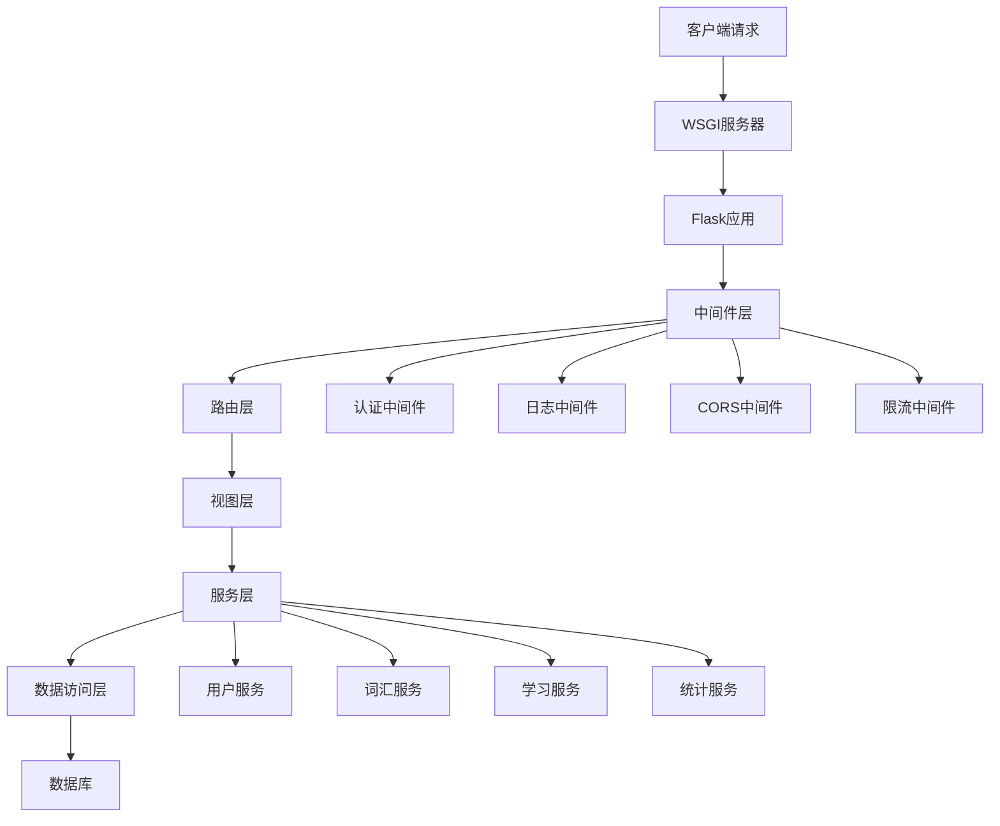

# 后端技术规格

## 技术栈

### 核心框架
- **Python 3.11+**: 开发语言
- **Flask 2.3**: Web框架
- **SQLAlchemy 2.0**: ORM框架
- **Flask-Migrate**: 数据库迁移

### 开发工具
- **pytest**: 测试框架
- **black**: 代码格式化
- **flake8**: 代码检查

## 服务架构设计

### 应用架构图



### 模块化设计

```
backend/
├── app/
│   ├── __init__.py
│   ├── config.py              # 配置管理
│   ├── models/                # 数据模型
│   │   ├── __init__.py
│   │   ├── user.py
│   │   ├── vocabulary.py
│   │   ├── learning.py
│   │   └── statistics.py
│   ├── views/                 # 视图函数
│   │   ├── __init__.py
│   │   ├── auth.py
│   │   ├── vocabulary.py
│   │   ├── learning.py
│   │   └── statistics.py
│   ├── services/              # 业务逻辑
│   │   ├── __init__.py
│   │   ├── user_service.py
│   │   ├── vocabulary_service.py
│   │   ├── learning_service.py
│   │   ├── algorithm_service.py
│   │   └── statistics_service.py
│   ├── utils/                 # 工具函数
│   │   ├── __init__.py
│   │   ├── auth.py
│   │   ├── validators.py
│   │   ├── decorators.py
│   │   └── helpers.py
│   └── extensions.py          # 扩展初始化
├── migrations/                # 数据库迁移
├── tests/                     # 测试文件
├── requirements.txt           # 依赖列表
└── run.py                     # 应用入口
```

## 核心业务逻辑

### 用户管理服务

用户管理服务负责处理用户注册、认证和个人信息管理。

**主要功能：**
- 用户注册和验证
- 用户登录和认证
- 个人资料更新
- 学习偏好管理

**伪代码示例：**
```
createUser(userData):
    if userExists(userData.email):
        raise Error("用户已存在")

    hashedPassword = hash(userData.password)
    user = User(
        email=userData.email,
        username=userData.username,
        passwordHash=hashedPassword
    )
    save(user)
    return user

authenticateUser(email, password):
    user = findUserByEmail(email)
    if user and verifyPassword(password, user.passwordHash):
        return user
    return None
```

### 词汇管理服务

词汇管理服务处理词汇库的维护和用户词汇学习列表管理。

**主要功能：**
- 词汇查询和筛选
- 词汇分类管理
- 用户词汇列表管理
- 学习队列生成

**伪代码示例：**
```
getVocabularyList(filters):
    query = baseQuery()

    if filters.category:
        query = query.filter(category=filters.category)
    if filters.difficulty:
        query = query.filter(difficulty=filters.difficulty)

    return paginate(query, page=filters.page, limit=filters.limit)

addVocabularyToUser(userId, vocabularyId):
    if alreadyExists(userId, vocabularyId):
        return existingRecord

    userVocab = UserVocabulary(
        userId=userId,
        vocabularyId=vocabularyId,
        masteryLevel=0,
        nextReview=now()
    )
    save(userVocab)
    return userVocab
```

### 学习算法服务

学习算法服务实现自适应学习机制，根据用户表现调整学习内容和复习时间。

**主要功能：**
- 自适应难度评分
- 复习时间计算
- 学习路径优化
- 优先级排序

**伪代码示例：**
```
calculateDifficultyScore(userVocabulary):
    if userVocabulary.reviewCount == 0:
        return 1.0

    accuracy = userVocabulary.correctCount / userVocabulary.reviewCount
    masteryFactor = userVocabulary.masteryLevel / 5.0
    timeFactor = calculateTimeFactor(userVocabulary.lastReview)

    score = accuracy * 0.4 + masteryFactor * 0.3 + timeFactor * 0.3
    return clamp(score, 0.0, 1.0)

calculateNextReview(userVocabulary, isCorrect):
    if isCorrect:
        userVocabulary.consecutiveCorrect += 1
    else:
        userVocabulary.consecutiveCorrect = 0

    intervalHours = getInterval(userVocabulary.consecutiveCorrect)
    nextReview = now() + hours(intervalHours)

    updateReviewTime(userVocabulary, nextReview)
    return nextReview
```

### 统计服务

统计服务提供学习数据分析功能，帮助用户了解学习进度和效果。

**主要功能：**
- 学习统计计算
- 趋势分析
- 掌握度分布
- 成就追踪

**伪代码示例：**
```
getUserStatistics(userId):
    totalWords = countUserVocabularies(userId)
    masteredWords = countMasteredVocabularies(userId)

    correctCount = sumCorrectAnswers(userId)
    totalReviews = sumTotalReviews(userId)
    accuracy = correctCount / totalReviews if totalReviews > 0 else 0

    todayStats = calculateTodayStats(userId)

    return {
        totalWords: totalWords,
        masteredWords: masteredWords,
        accuracyRate: accuracy,
        todayStudyTime: todayStats.studyTime,
        todayWordsStudied: todayStats.wordsStudied
    }
```

## 安全设计

### 认证和授权

使用JWT令牌进行用户认证，确保API访问安全。

**主要机制：**
- JWT令牌生成和验证
- 令牌刷新机制
- 权限控制装饰器
- API访问限制

**伪代码示例：**
```
generateToken(userId, expiresIn=3600):
    payload = {
        userId: userId,
        exp: now() + seconds(expiresIn),
        iat: now()
    }
    return jwt.encode(payload, secretKey)

verifyToken(token):
    try:
        payload = jwt.decode(token, secretKey)
        return payload.userId
    except:
        return None

requireAuth(handler):
    def wrapper(*args, **kwargs):
        token = getTokenFromHeader()
        userId = verifyToken(token)
        if not userId:
            raise UnauthorizedError()
        return handler(userId=userId, *args, **kwargs)
    return wrapper
```

### 输入验证

使用Marshmallow进行数据验证，确保输入数据的安全性和完整性。

**验证规则：**
- 数据类型验证
- 长度限制
- 格式检查
- 业务规则验证

**伪代码示例：**
```
validateUserRegistration(data):
    schema = UserRegistrationSchema()
    try:
        validatedData = schema.load(data)
        return validatedData
    except ValidationError as err:
        raise ValidationError(err.messages)

UserRegistrationSchema:
    email: EmailField(required=True)
    username: StringField(required=True, minLength=3, maxLength=50)
    password: StringField(required=True, minLength=8, maxLength=128)
```

### 错误处理

统一的错误处理机制，提供清晰的错误信息。

**错误类型：**
- 验证错误
- 业务逻辑错误
- 系统错误
- 权限错误

**伪代码示例：**
```
handleApiError(error):
    response = {
        success: false,
        error: {
            code: error.code,
            message: error.message
        }
    }
    if error.details:
        response.error.details = error.details

    return jsonify(response), error.statusCode
```

## 性能优化

### 数据库优化

**查询优化：**
- 使用预加载避免N+1查询
- 合理使用索引
- 分页查询
- 聚合查询优化

**伪代码示例：**
```
getUserVocabularyWithDetails(userId):
    return query(UserVocabulary)
        .options(
            joinedload(UserVocabulary.vocabulary),
            joinedload(UserVocabulary.vocabulary.category)
        )
        .filter(UserVocabulary.userId == userId)
        .all()

getVocabularyListWithPagination(page, limit, filters):
    query = query(Vocabulary).filter(Vocabulary.isActive == true)

    if filters.category:
        query = query.filter(Vocabulary.categoryId == filters.category)

    return query.paginate(page=page, perPage=limit)
```

### 缓存策略

**缓存机制：**
- Redis缓存热点数据
- 查询结果缓存
- 用户会话缓存
- 缓存失效策略

**伪代码示例：**
```
cacheGet(key):
    data = redis.get(key)
    if data:
        return json.decode(data)
    return null

cacheSet(key, value, ttl=3600):
    redis.setex(key, ttl, json.encode(value))

getUserStatisticsCached(userId):
    cacheKey = f"user_stats:{userId}"
    stats = cacheGet(cacheKey)

    if not stats:
        stats = calculateUserStatistics(userId)
        cacheSet(cacheKey, stats, ttl=300)  # 5分钟缓存

    return stats
```

## 测试策略

### 单元测试

**测试覆盖：**
- 服务层业务逻辑
- 数据模型验证
- 工具函数
- 边界条件

**伪代码示例：**
```
testCreateUser():
    # Given
    userData = {
        email: "test@example.com",
        username: "testuser",
        password: "password123"
    }

    # When
    user = userService.createUser(userData)

    # Then
    assert user.email == userData.email
    assert user.username == userData.username
    assert user.passwordHash != userData.password

testAuthenticateUserSuccess():
    # Given
    user = createTestUser()

    # When
    authenticated = userService.authenticateUser(
        user.email,
        "password123"
    )

    # Then
    assert authenticated.id == user.id
```

### 集成测试

**测试范围：**
- API端点测试
- 数据库操作
- 第三方服务集成
- 完整业务流程

**伪代码示例：**
```
testLearningFlow():
    # 创建用户并登录
    user = registerAndLoginUser()

    # 开始学习会话
    session = startLearningSession(user.token)

    # 提交答案
    result = submitAnswer(
        sessionId=session.id,
        vocabularyId=session.vocabularies[0].id,
        answer="correctAnswer"
    )

    # 验证结果
    assert result.isCorrect == true
    assert result.pointsEarned > 0

    # 完成会话
    summary = completeSession(session.id)
    assert summary.wordsStudied == 1
```

## 部署配置

### 应用配置

**环境配置：**
- 开发环境配置
- 测试环境配置
- 生产环境配置
- 环境变量管理

**伪代码示例：**
```
class Config:
    secretKey = env.get('SECRET_KEY')
    databaseUrl = env.get('DATABASE_URL')
    jwtSecretKey = env.get('JWT_SECRET_KEY')
    redisUrl = env.get('REDIS_URL')

class ProductionConfig(Config):
    debug = false
    sqlalchemyEngineOptions = {
        poolPrePing: true,
        poolRecycle: 300
    }

class DevelopmentConfig(Config):
    debug = true
    sqlalchemyEcho = true
```

### WSGI配置

**服务器配置：**
- Gunicorn配置
- 工作进程数
- 超时设置
- 连接管理

**伪代码示例：**
```
# Gunicorn配置
bind = "0.0.0.0:5000"
workers = 4
workerClass = "sync"
timeout = 30
keepalive = 2
maxRequests = 1000
preloadApp = true
```

## 监控和日志

### 日志配置

**日志级别：**
- DEBUG: 调试信息
- INFO: 一般信息
- WARNING: 警告信息
- ERROR: 错误信息
- CRITICAL: 严重错误

**伪代码示例：**
```
setupLogging():
    if not debugMode:
        createLogDirectory()

        fileHandler = RotatingFileHandler(
            filename='logs/app.log',
            maxBytes=10MB,
            backupCount=10
        )

        fileHandler.setFormatter(
            formatter('%(asctime)s %(levelname)s: %(message)s')
        )

        logger.addHandler(fileHandler)
        logger.setLevel(INFO)
```

### 性能监控

**监控指标：**
- API响应时间
- 错误率统计
- 数据库查询性能
- 内存使用情况

**伪代码示例：**
```
monitorPerformance(handler):
    def wrapper(*args, **kwargs):
        startTime = now()

        result = handler(*args, **kwargs)

        executionTime = now() - startTime

        logPerformance(
            endpoint=request.endpoint,
            executionTime=executionTime,
            statusCode=result.statusCode
        )

        return result
    return wrapper
```