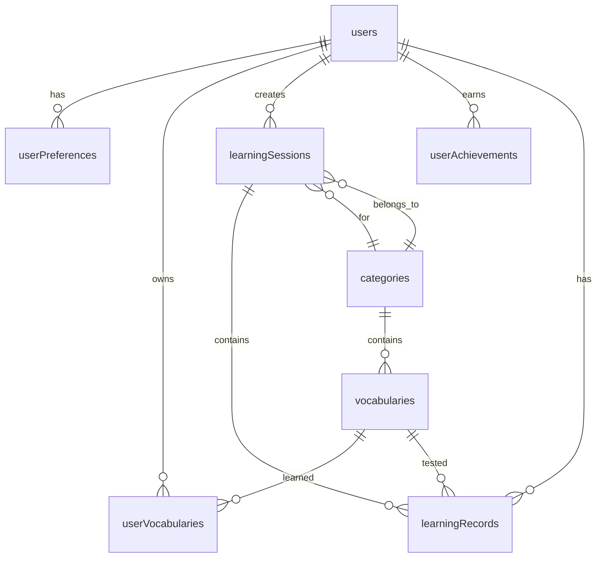

# 数据库技术规格

## 数据库选择

### SQLite 3.x
- **版本**: SQLite 3.40+
- **选择理由**:
  - 零配置，适合中小型应用
  - 事务支持完善，ACID兼容
  - 文件型数据库，部署简单
  - 性能优异，适合读多写少场景
  - 支持并发访问（WAL模式）

### 配置优化

启用WAL模式提高并发性能：
```
PRAGMA journal_mode=WAL
PRAGMA synchronous=NORMAL
PRAGMA cache_size=10000
PRAGMA temp_store=MEMORY
```

## 数据表结构设计

### 用户表 (users)

存储用户基本信息和认证数据。

**字段说明：**
- `id`: 主键，自增
- `email`: 邮箱，唯一索引
- `username`: 用户名，唯一索引
- `passwordHash`: 密码哈希值
- `avatarUrl`: 头像URL
- `createdAt`: 创建时间
- `updatedAt`: 更新时间
- `isActive`: 账户状态
- `emailVerified`: 邮箱验证状态

**伪代码：**
```
CREATE TABLE users (
    id INTEGER PRIMARY KEY AUTOINCREMENT,
    email VARCHAR(255) NOT NULL UNIQUE,
    username VARCHAR(100) NOT NULL UNIQUE,
    passwordHash VARCHAR(255) NOT NULL,
    avatarUrl VARCHAR(500),
    createdAt DATETIME DEFAULT CURRENT_TIMESTAMP,
    updatedAt DATETIME DEFAULT CURRENT_TIMESTAMP,
    isActive BOOLEAN DEFAULT TRUE,
    emailVerified BOOLEAN DEFAULT FALSE
)

CREATE INDEX idx_users_email ON users(email)
CREATE INDEX idx_users_username ON users(username)
```

### 用户偏好表 (user_preferences)

存储用户的学习偏好设置。

**主要字段：**
- `userId`: 关联用户ID
- `dailyGoal`: 每日学习目标
- `preferredDifficulty`: 偏好难度
- `soundEnabled`: 音频开关
- `notificationsEnabled`: 通知开关
- `theme`: 主题设置
- `language`: 语言设置
- `autoPronunciation`: 自动发音
- `studyReminderTime`: 学习提醒时间

**伪代码：**
```
CREATE TABLE user_preferences (
    id INTEGER PRIMARY KEY AUTOINCREMENT,
    userId INTEGER NOT NULL,
    dailyGoal INTEGER DEFAULT 20,
    preferredDifficulty VARCHAR(20) DEFAULT 'medium',
    soundEnabled BOOLEAN DEFAULT TRUE,
    notificationsEnabled BOOLEAN DEFAULT TRUE,
    theme VARCHAR(20) DEFAULT 'light',
    language VARCHAR(10) DEFAULT 'zh-CN',
    autoPronunciation BOOLEAN DEFAULT TRUE,
    studyReminderTime VARCHAR(10) DEFAULT '19:00',
    FOREIGN KEY (userId) REFERENCES users(id) ON DELETE CASCADE
)
```

### 词汇分类表 (categories)

词汇分类管理，支持层级结构。

**主要字段：**
- `name`: 分类名称
- `description`: 分类描述
- `icon`: 图标标识
- `color`: 主题色
- `sortOrder`: 排序权重
- `isActive`: 是否启用

**伪代码：**
```
CREATE TABLE categories (
    id INTEGER PRIMARY KEY AUTOINCREMENT,
    name VARCHAR(100) NOT NULL,
    description TEXT,
    icon VARCHAR(50),
    color VARCHAR(7),
    sortOrder INTEGER DEFAULT 0,
    isActive BOOLEAN DEFAULT TRUE
)

CREATE INDEX idx_categories_sort_order ON categories(sortOrder)
```

### 词汇表 (vocabularies)

存储所有词汇的详细信息。

**主要字段：**
- `word`: 单词
- `pronunciation`: 音标
- `definition`: 释义
- `exampleSentence`: 例句
- `translation`: 翻译
- `difficulty`: 难度等级
- `frequencyRank`: 使用频率排名
- `audioUrl`: 音频URL
- `imageUrl`: 图片URL
- `categoryId`: 所属分类
- `tags`: 标签（JSON格式）
- `etymology`: 词源
- `synonyms`: 同义词（JSON格式）
- `antonyms`: 反义词（JSON格式）

**伪代码：**
```
CREATE TABLE vocabularies (
    id INTEGER PRIMARY KEY AUTOINCREMENT,
    word VARCHAR(200) NOT NULL,
    pronunciation VARCHAR(500),
    definition TEXT NOT NULL,
    exampleSentence TEXT,
    translation TEXT,
    difficulty VARCHAR(20) DEFAULT 'medium',
    frequencyRank INTEGER,
    audioUrl VARCHAR(500),
    imageUrl VARCHAR(500),
    categoryId INTEGER,
    tags TEXT,
    etymology TEXT,
    synonyms TEXT,
    antonyms TEXT,
    isActive BOOLEAN DEFAULT TRUE,
    FOREIGN KEY (categoryId) REFERENCES categories(id)
)

CREATE UNIQUE INDEX idx_vocabularies_word_unique ON vocabularies(word)
CREATE INDEX idx_vocabularies_difficulty ON vocabularies(difficulty)
CREATE INDEX idx_vocabularies_category_id ON vocabularies(categoryId)
```

### 用户词汇关联表 (user_vocabularies)

记录用户的词汇学习进度和掌握情况。

**主要字段：**
- `userId`: 用户ID
- `vocabularyId`: 词汇ID
- `masteryLevel`: 掌握度（0-5级）
- `reviewCount`: 复习次数
- `correctCount`: 正确次数
- `consecutiveCorrect`: 连续正确次数
- `lastReview`: 最后复习时间
- `nextReview`: 下次复习时间
- `isFavorite`: 是否收藏
- `notes`: 学习笔记

**伪代码：**
```
CREATE TABLE user_vocabularies (
    id INTEGER PRIMARY KEY AUTOINCREMENT,
    userId INTEGER NOT NULL,
    vocabularyId INTEGER NOT NULL,
    masteryLevel INTEGER DEFAULT 0,
    reviewCount INTEGER DEFAULT 0,
    correctCount INTEGER DEFAULT 0,
    consecutiveCorrect INTEGER DEFAULT 0,
    lastReview DATETIME,
    nextReview DATETIME,
    isFavorite BOOLEAN DEFAULT FALSE,
    notes TEXT,
    FOREIGN KEY (userId) REFERENCES users(id) ON DELETE CASCADE,
    FOREIGN KEY (vocabularyId) REFERENCES vocabularies(id) ON DELETE CASCADE,
    UNIQUE(userId, vocabularyId)
)

CREATE INDEX idx_user_vocabularies_user_review ON user_vocabularies(userId, nextReview)
CREATE INDEX idx_user_vocabularies_mastery ON user_vocabularies(userId, masteryLevel)
```

### 学习会话表 (learning_sessions)

记录每次学习会话的信息。

**主要字段：**
- `userId`: 用户ID
- `sessionType`: 会话类型
- `startTime`: 开始时间
- `endTime`: 结束时间
- `duration`: 持续时间（秒）
- `wordsStudied`: 学习词汇数
- `correctAnswers`: 正确答案数
- `totalAnswers`: 总答案数
- `difficultyLevel`: 难度级别
- `categoryId`: 学习分类

**伪代码：**
```
CREATE TABLE learning_sessions (
    id INTEGER PRIMARY KEY AUTOINCREMENT,
    userId INTEGER NOT NULL,
    sessionType VARCHAR(50) DEFAULT 'vocabulary',
    startTime DATETIME NOT NULL,
    endTime DATETIME,
    duration INTEGER DEFAULT 0,
    wordsStudied INTEGER DEFAULT 0,
    correctAnswers INTEGER DEFAULT 0,
    totalAnswers INTEGER DEFAULT 0,
    difficultyLevel VARCHAR(20),
    categoryId INTEGER,
    FOREIGN KEY (userId) REFERENCES users(id) ON DELETE CASCADE,
    FOREIGN KEY (categoryId) REFERENCES categories(id)
)

CREATE INDEX idx_learning_sessions_user_start ON learning_sessions(userId, startTime)
```

### 学习记录表 (learning_records)

记录每个答题的详细信息。

**主要字段：**
- `sessionId`: 会话ID
- `userId`: 用户ID
- `vocabularyId`: 词汇ID
- `questionType`: 题目类型
- `userAnswer`: 用户答案
- `correctAnswer`: 正确答案
- `isCorrect`: 是否正确
- `responseTime`: 响应时间（毫秒）
- `difficultyAtMoment`: 答题时难度

**伪代码：**
```
CREATE TABLE learning_records (
    id INTEGER PRIMARY KEY AUTOINCREMENT,
    sessionId INTEGER NOT NULL,
    userId INTEGER NOT NULL,
    vocabularyId INTEGER NOT NULL,
    questionType VARCHAR(50),
    userAnswer TEXT,
    correctAnswer TEXT,
    isCorrect BOOLEAN,
    responseTime INTEGER,
    difficultyAtMoment INTEGER,
    FOREIGN KEY (sessionId) REFERENCES learning_sessions(id) ON DELETE CASCADE,
    FOREIGN KEY (userId) REFERENCES users(id) ON DELETE CASCADE,
    FOREIGN KEY (vocabularyId) REFERENCES vocabularies(id) ON DELETE CASCADE
)

CREATE INDEX idx_learning_records_session ON learning_records(sessionId)
CREATE INDEX idx_learning_records_user_vocabulary ON learning_records(userId, vocabularyId)
```

### 用户成就表 (user_achievements)

记录用户获得的各种成就。

**主要字段：**
- `userId`: 用户ID
- `achievementType`: 成就类型
- `achievementName`: 成就名称
- `description`: 成就描述
- `icon`: 成就图标
- `earnedAt`: 获得时间
- `metadata`: 额外数据（JSON格式）

**伪代码：**
```
CREATE TABLE user_achievements (
    id INTEGER PRIMARY KEY AUTOINCREMENT,
    userId INTEGER NOT NULL,
    achievementType VARCHAR(100) NOT NULL,
    achievementName VARCHAR(200) NOT NULL,
    description TEXT,
    icon VARCHAR(100),
    earnedAt DATETIME DEFAULT CURRENT_TIMESTAMP,
    metadata TEXT,
    FOREIGN KEY (userId) REFERENCES users(id) ON DELETE CASCADE
)

CREATE INDEX idx_user_achievements_user_type ON user_achievements(userId, achievementType)
```

### 系统配置表 (system_settings)

存储系统级别的配置信息。

**主要字段：**
- `key`: 配置键
- `value`: 配置值
- `description`: 配置描述
- `dataType`: 数据类型
- `isPublic`: 是否公开

**伪代码：**
```
CREATE TABLE system_settings (
    id INTEGER PRIMARY KEY AUTOINCREMENT,
    key VARCHAR(100) NOT NULL UNIQUE,
    value TEXT,
    description TEXT,
    dataType VARCHAR(20) DEFAULT 'string',
    isPublic BOOLEAN DEFAULT FALSE
)

CREATE INDEX idx_system_settings_key ON system_settings(key)
```

## 数据关系图



## 索引策略

### 主要索引

**用户相关索引：**
```
idx_users_email_active: users(email, isActive)
idx_users_created_at_active: users(createdAt, isActive)
```

**词汇相关索引：**
```
idx_vocabularies_difficulty_active: vocabularies(difficulty, isActive)
idx_vocabularies_category_difficulty: vocabularies(categoryId, difficulty)
idx_vocabularies_word_active: vocabularies(word, isActive)
```

**学习相关索引：**
```
idx_user_vocabularies_review_queue: user_vocabularies(userId, nextReview, masteryLevel)
idx_user_vocabularies_updated_at: user_vocabularies(updatedAt)
idx_learning_sessions_user_date: learning_sessions(userId, DATE(startTime))
idx_learning_records_user_time: learning_records(userId, createdAt)
```

## 数据初始化

### 基础数据

**词汇分类初始化：**
- 日常用语
- 商务英语
- 学术词汇
- 旅游英语
- 考试词汇

**系统配置初始化：**
- 应用名称
- 每日最大学习词汇数
- 复习间隔设置
- 难度级别定义

**伪代码示例：**
```
init_categories():
    categories = [
        {name: "日常用语", icon: "home", color: "#3B82F6"},
        {name: "商务英语", icon: "briefcase", color: "#10B981"},
        {name: "学术词汇", icon: "graduation-cap", color: "#8B5CF6"},
        {name: "旅游英语", icon: "plane", color: "#F59E0B"}
    ]

    for cat in categories:
        createCategory(cat)

init_system_settings():
    settings = [
        {key: "appName", value: "BDC - 英语词汇学习", isPublic: true},
        {key: "maxDailyWords", value: "50", isPublic: true},
        {key: "reviewIntervals", value: "[1, 6, 24, 72, 168]", isPublic: false}
    ]

    for setting in settings:
        createSetting(setting)
```

## 性能优化

### 查询优化

**优化策略：**
- 使用复合索引优化常用查询
- 避免N+1查询问题
- 使用分页减少数据传输
- 合理使用聚合查询

**伪代码示例：**
```
-- 优化：获取用户待复习词汇
SELECT v.*, uv.masteryLevel, uv.nextReview
FROM vocabularies v
JOIN user_vocabularies uv ON v.id = uv.vocabularyId
WHERE uv.userId = ?
  AND uv.nextReview <= datetime('now')
  AND v.isActive = 1
ORDER BY uv.nextReview, uv.masteryLevel
LIMIT 20

-- 优化：学习统计查询
SELECT
    COUNT(*) as totalWords,
    SUM(uv.correctCount) as totalCorrect,
    SUM(uv.reviewCount) as totalReviews,
    COUNT(CASE WHEN uv.masteryLevel >= 4 THEN 1 END) as masteredWords
FROM user_vocabularies uv
WHERE uv.userId = ?
```

### 批量操作

**批量插入：**
- 使用事务保证数据一致性
- 批量插入减少IO操作
- 合理设置批次大小

**批量更新：**
- 使用CASE语句批量更新
- 避免循环单条更新
- 保持索引效率

## 备份和恢复

### 备份策略

**自动备份：**
- 每日定时备份
- 保留7天备份文件
- 压缩备份文件
- 验证备份完整性

**备份流程：**
```
1. 暂停写入操作（或使用快照）
2. 复制数据库文件
3. 压缩备份文件
4. 上传到备份存储
5. 验证备份文件
6. 清理过期备份
```

### 恢复流程

**恢复步骤：**
1. 停止应用服务
2. 备份当前数据库
3. 解压备份文件
4. 替换数据库文件
5. 验证数据完整性
6. 重启应用服务

## 数据迁移

### 版本控制

使用Alembic进行数据库版本管理：
- 记录所有变更
- 支持版本回滚
- 自动生成迁移脚本
- 支持多环境部署

### 迁移脚本

**迁移流程：**
```
1. 生成迁移脚本
2. 审查变更内容
3. 在测试环境验证
4. 备份生产数据库
5. 执行迁移
6. 验证迁移结果
```

## 监控和维护

### 性能监控

**监控指标：**
- 查询执行时间
- 索引使用率
- 数据库大小
- 连接数统计

**维护任务：**
- 定期分析表统计信息
- 清理过期数据
- 重建索引
- 优化查询

### 数据清理

**清理策略：**
- 归档旧的学习记录
- 清理孤立数据
- 压缩历史数据
- 保持数据库精简