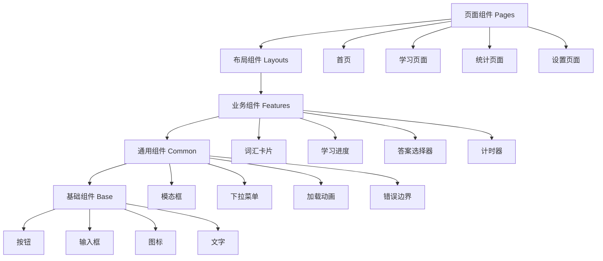

# 前端技术规格

## 技术栈

### 核心框架
- **React 18**: 主框架，支持并发特性
- **TypeScript 5.0+**: 类型安全和开发体验
- **Vite**: 构建工具，快速开发和热重载

### 样式方案
- **Tailwind CSS 3.x**: 原子化CSS框架
- **Headless UI**: 无样式组件库
- **Framer Motion**: 动画库

### 状态管理
- **Zustand**: 轻量级状态管理
- **React Query (TanStack Query)**: 服务端状态管理

### 路由和导航
- **React Router v6**: 客户端路由
- **React Intersection Observer**: 滚动监听

## 组件架构

### 组件分层结构



### 组件设计原则

#### 单一职责原则
- 每个组件只负责一个功能
- 保持组件的简洁性和可维护性
- 避免组件过于复杂

#### 可复用性
- 通过props配置组件行为
- 使用组合而非继承
- 提供合理的默认值

#### 类型安全
- 严格的TypeScript类型定义
- 接口和类型别名清晰
- 避免使用any类型

## 核心组件规格

### 词汇卡片组件 (VocabularyCard)

展示词汇信息和学习界面的核心组件。

**接口定义：**
```typescript
interface VocabularyCardProps {
  vocabulary: Vocabulary;
  showAnswer: boolean;
  onAnswer: (isCorrect: boolean) => void;
  onNext: () => void;
  isLoading?: boolean;
}
```

**功能要求：**
- 支持翻转动画效果
- 显示单词、音标、释义、例句
- 支持音频播放
- 响应式设计
- 无障碍访问支持

### 学习进度组件 (LearningProgress)

展示用户学习进度和统计数据。

**接口定义：**
```typescript
interface LearningProgressProps {
  totalWords: number;
  learnedWords: number;
  correctRate: number;
  studyTime: number;
  dailyGoal: number;
}
```

**功能要求：**
- 圆形进度条显示
- 统计数据可视化
- 动画效果
- 数据更新时平滑过渡

### 答案选择器组件 (AnswerSelector)

用于用户选择答案的交互组件。

**接口定义：**
```typescript
interface AnswerSelectorProps {
  options: string[];
  correctAnswer: string;
  onSelect: (answer: string) => void;
  selectedAnswer?: string;
  showResult?: boolean;
}
```

**功能要求：**
- 支持单选和多选模式
- 答案验证和反馈
- 键盘导航支持
- 无障碍访问支持

## 状态管理架构

### Zustand Store结构

全局状态管理使用Zustand，按功能模块划分。

**状态结构：**
```typescript
interface AppState {
  // 用户状态
  user: {
    profile: UserProfile | null;
    preferences: UserPreferences;
    isAuthenticated: boolean;
  };

  // 学习状态
  learning: {
    currentSession: LearningSession | null;
    vocabularyQueue: Vocabulary[];
    currentIndex: number;
    statistics: LearningStatistics;
  };

  // UI状态
  ui: {
    theme: 'light' | 'dark';
    sidebarOpen: boolean;
    loading: boolean;
    error: string | null;
  };
}
```

### 状态更新规则

#### 不可变性
- 使用Immer进行状态更新
- 避免直接修改状态
- 确保状态更新的一致性

#### 异步状态处理
- 使用React Query管理服务端状态
- 乐观更新策略
- 错误处理和重试机制

## 页面路由结构

### 路由配置

使用React Router v6实现客户端路由。

**路由定义：**
```typescript
const routes = [
  {
    path: '/',
    element: <HomePage />,
    index: true
  },
  {
    path: '/learn',
    element: <LearnPage />,
    children: [
      {
        path: 'vocabulary',
        element: <VocabularyLearning />
      },
      {
        path: 'review',
        element: <ReviewLearning />
      }
    ]
  },
  {
    path: '/statistics',
    element: <StatisticsPage />
  },
  {
    path: '/settings',
    element: <SettingsPage />,
    children: [
      {
        path: 'profile',
        element: <ProfileSettings />
      },
      {
        path: 'preferences',
        element: <PreferenceSettings />
      }
    ]
  }
];
```

### 路由守卫

实现认证和权限控制。

**私有路由组件：**
```typescript
const PrivateRoute: React.FC<{ children: React.ReactNode }> = ({ children }) => {
  const { isAuthenticated } = useUserStore();

  if (!isAuthenticated) {
    return <Navigate to="/login" replace />;
  }

  return <>{children}</>;
};
```

## UI/UX设计要求

### 设计系统

#### 颜色规范
```typescript
const colors = {
  primary: {
    50: '#eff6ff',
    500: '#3b82f6',
    900: '#1e3a8a'
  },
  secondary: {
    50: '#f8fafc',
    500: '#64748b',
    900: '#0f172a'
  },
  success: '#10b981',
  warning: '#f59e0b',
  error: '#ef4444'
};
```

#### 字体规范
```typescript
const typography = {
  fontFamily: {
    sans: ['Inter', 'system-ui', 'sans-serif'],
    mono: ['JetBrains Mono', 'monospace']
  },
  fontSize: {
    xs: ['0.75rem', { lineHeight: '1rem' }],
    sm: ['0.875rem', { lineHeight: '1.25rem' }],
    base: ['1rem', { lineHeight: '1.5rem' }],
    lg: ['1.125rem', { lineHeight: '1.75rem' }],
    xl: ['1.25rem', { lineHeight: '1.75rem' }]
  }
};
```

#### 间距规范
```typescript
const spacing = {
  xs: '0.25rem',
  sm: '0.5rem',
  md: '1rem',
  lg: '1.5rem',
  xl: '2rem',
  '2xl': '3rem'
};
```

### 交互设计

#### 按钮状态
- Default: 默认状态
- Hover: 鼠标悬停
- Active: 点击激活
- Disabled: 禁用状态
- Loading: 加载状态

#### 动画效果
使用Framer Motion实现流畅的动画效果。

**常用动画：**
```typescript
const animations = {
  fadeIn: {
    initial: { opacity: 0 },
    animate: { opacity: 1 },
    exit: { opacity: 0 }
  },
  slideUp: {
    initial: { y: 20, opacity: 0 },
    animate: { y: 0, opacity: 1 },
    exit: { y: -20, opacity: 0 }
  },
  scale: {
    initial: { scale: 0.95 },
    animate: { scale: 1 },
    exit: { scale: 0.95 }
  }
};
```

### 响应式设计

#### 断点设置
```typescript
const breakpoints = {
  sm: '640px',   // 手机
  md: '768px',   // 平板
  lg: '1024px',  // 笔记本
  xl: '1280px',  // 桌面
  '2xl': '1536px' // 大屏
};
```

#### 布局适配
- 移动端优先设计
- 弹性布局和网格系统
- 触摸友好的交互元素

## 性能优化策略

### 代码分割

**路由级别的代码分割：**
```typescript
const LearnPage = lazy(() => import('./pages/LearnPage'));
const StatisticsPage = lazy(() => import('./pages/StatisticsPage'));

// 组件级别的代码分割
const VocabularyCard = lazy(() => import('./components/VocabularyCard'));
```

### 组件优化

**React.memo使用：**
```typescript
const VocabularyCard = React.memo<VocabularyCardProps>(({
  vocabulary,
  showAnswer,
  onAnswer,
  onNext
}) => {
  // 组件实现
}, (prevProps, nextProps) => {
  // 自定义比较函数
  return prevProps.vocabulary.id === nextProps.vocabulary.id &&
         prevProps.showAnswer === nextProps.showAnswer;
});
```

**useMemo和useCallback：**
```typescript
const expensiveValue = useMemo(() => {
  return computeExpensiveValue(data);
}, [data]);

const handleClick = useCallback(() => {
  onAction(id);
}, [onAction, id]);
```

### 资源优化

#### 图片优化
- 使用WebP格式
- 实现懒加载
- 响应式图片

#### 字体优化
- 字体预加载
- 字体子集化
- FOUT和FOIT处理

## 测试策略

### 单元测试

**组件测试：**
```typescript
describe('VocabularyCard', () => {
  it('should display vocabulary word', () => {
    const mockVocabulary = {
      id: 1,
      word: 'example',
      pronunciation: '/ɪɡˈzæmpəl/',
      definition: 'a thing characteristic of its kind'
    };

    render(
      <VocabularyCard
        vocabulary={mockVocabulary}
        showAnswer={false}
        onAnswer={jest.fn()}
        onNext={jest.fn()}
      />
    );

    expect(screen.getByText('example')).toBeInTheDocument();
  });
});
```

### 集成测试
- API集成测试
- 路由导航测试
- 状态管理测试

### E2E测试
- 用户流程测试
- 跨浏览器测试
- 性能测试

## 部署配置

### 构建配置

**Vite配置：**
```typescript
// vite.config.ts
export default defineConfig({
  plugins: [react()],
  resolve: {
    alias: {
      '@': resolve(__dirname, 'src'),
      '@components': resolve(__dirname, 'src/components'),
      '@pages': resolve(__dirname, 'src/pages'),
      '@store': resolve(__dirname, 'src/store'),
      '@utils': resolve(__dirname, 'src/utils')
    }
  },
  build: {
    rollupOptions: {
      output: {
        manualChunks: {
          vendor: ['react', 'react-dom'],
          ui: ['framer-motion', '@headlessui/react'],
          utils: ['zustand', '@tanstack/react-query']
        }
      }
    }
  }
});
```

### 环境变量配置

**环境变量：**
```typescript
// .env.development
VITE_API_BASE_URL=http://localhost:5000/api
VITE_APP_VERSION=1.0.0
VITE_DEBUG=true

// .env.production
VITE_API_BASE_URL=https://api.example.com
VITE_APP_VERSION=1.0.0
VITE_DEBUG=false
```

## 无障碍访问

### ARIA支持
- 语义化HTML标签
- ARIA标签和属性
- 键盘导航支持

### 屏幕阅读器支持
- 图片alt文本
- 表单标签关联
- 状态变化通知

### 对比度和可读性
- WCAG 2.1 AA标准
- 色彩对比度检查
- 字体大小适配