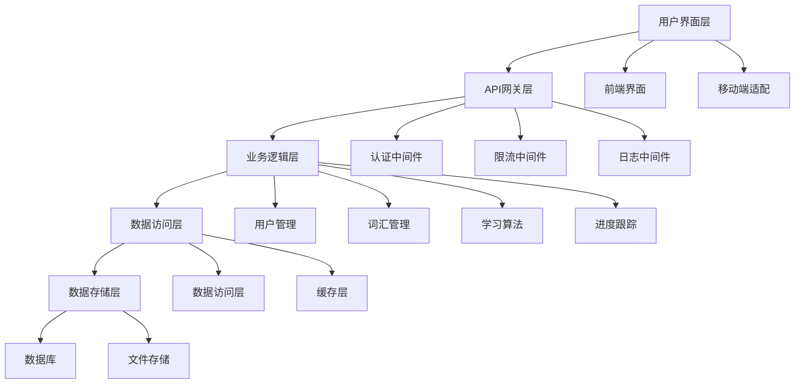

# 技术规格总览

## 项目概述

本项目是一个专注于英语词汇学习的智能应用系统，通过科学的记忆算法和自适应学习机制帮助用户高效掌握英语词汇。系统采用前后端分离架构，提供个性化的学习体验。

## 核心原则

### 简洁性原则
- 界面设计简洁明了，避免不必要的复杂性
- 功能聚焦核心需求，不堆砌功能
- 代码结构清晰，遵循"如无必要勿增实体"原则

### 科学性原则
- 基于艾宾浩斯遗忘曲线的记忆算法
- 自适应难度评分系统
- 数据驱动的学习优化

### 用户中心原则
- 个性化学习路径
- 直观的用户体验
- 及时的学习反馈

## 整体系统架构



## 技术栈选择

### 前端技术栈
- **React 18**: 组件化框架
- **TypeScript**: 类型安全
- **Tailwind CSS**: 样式框架
- **Zustand**: 状态管理

### 后端技术栈
- **Python 3.11**: 开发语言
- **Flask 2.3**: Web框架
- **SQLAlchemy 2.0**: 数据库ORM

### 数据库选择
- **SQLite**: 关系型数据库，适合中小型应用

## 项目结构

```
bdc/
├── frontend/                 # 前端项目
│   ├── src/
│   │   ├── components/      # 组件
│   │   ├── pages/          # 页面
│   │   ├── store/          # 状态管理
│   │   ├── utils/          # 工具函数
│   │   └── styles/         # 样式
│   ├── public/
│   └── package.json
├── backend/                 # 后端项目
│   ├── app/
│   │   ├── models/         # 数据模型
│   │   ├── views/          # 视图
│   │   ├── services/       # 业务逻辑
│   │   ├── utils/          # 工具函数
│   │   └── config/         # 配置
│   ├── migrations/         # 数据库迁移
│   ├── tests/             # 测试
│   └── requirements.txt
├── doc/                   # 文档
└── README.md
```

## 核心功能模块

### 用户管理模块
- 用户注册、登录、认证
- 个人资料管理
- 学习偏好设置

### 词汇管理模块
- 词汇库维护
- 词汇分类管理
- 难度等级划分

### 学习算法模块
- 自适应难度评分
- 复习时间算法
- 学习路径优化

### 进度跟踪模块
- 学习统计
- 进度可视化
- 成就系统

## 性能要求

### 响应时间
- API响应时间 < 200ms
- 页面加载时间 < 1s
- 数据库查询优化

### 并发处理
- 支持100+并发用户
- 数据库连接池管理
- 缓存策略优化

### 可扩展性
- 模块化设计
- 水平扩展支持

## 安全设计

### 数据安全
- 用户密码加密存储
- API接口认证
- 数据传输加密

### 访问控制
- 权限控制
- 访问频率限制
- 安全防护