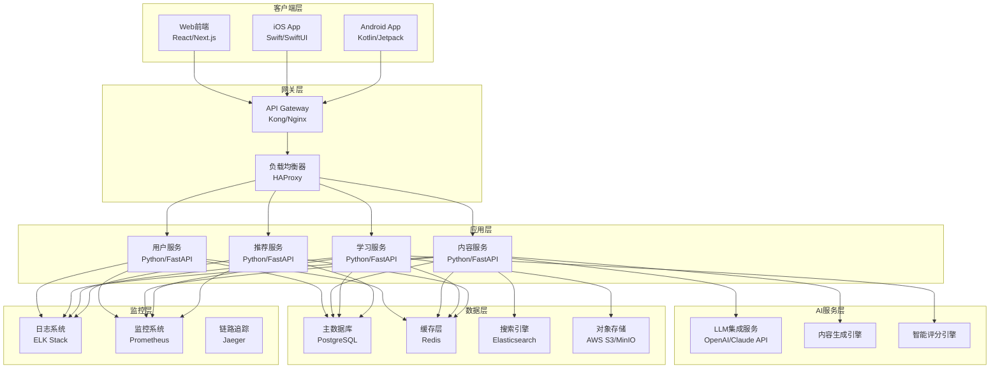

# 英语学习网站 - 技术规格说明书

## 目录
1. [系统概述](#系统概述)
2. [技术架构设计](#技术架构设计)
3. [核心功能技术规格](#核心功能技术规格)
4. [数据模型设计](#数据模型设计)
5. [API接口设计](#api接口设计)
6. [部署与运维方案](#部署与运维方案)
7. [性能与安全要求](#性能与安全要求)
8. [测试策略](#测试策略)
9. [风险评估与应对](#风险评估与应对)

---

## 系统概述

### 项目背景
智能英语阅读理解学习平台是一个基于大语言模型技术的个性化学习系统，旨在通过AI实时生成内容和智能难度调节，为用户提供高效的英语阅读学习体验。

### 技术目标
- 构建高可扩展、高可用的分布式系统
- 实现毫秒级响应的个性化推荐
- 支持千人千面的动态内容生成
- 保证99.9%的系统可用性
- 实现数据驱动的智能学习算法

---

## 技术架构设计

### 整体架构图



### 前端技术栈

#### Web端技术选择
```yaml
框架: Next.js 14
理由:
  - 支持SSR/SSG，优化SEO和首屏加载
  - 内置优化策略，性能表现优异
  - 生态完善，开发效率高
  - 支持API Routes，全栈开发便捷

UI框架:
  - Tailwind CSS 3.4 (原子化CSS)
  - Headless UI (无样式组件库)
  - Framer Motion (动画库)

状态管理:
  - Zustand (轻量级状态管理)
  - React Query (服务端状态管理)

构建工具:
  - TypeScript 5.0+
  - ESLint + Prettier
  - Husky (Git钩子)
```

#### 移动端技术选择
```yaml
iOS:
  框架: SwiftUI
  理由:
    - 原生性能最佳
    - 声明式UI开发
    - 与iOS生态深度集成

Android:
  框架: Jetpack Compose
  理由:
    - 现代化UI框架
    - Kotlin语言优势
    - Google官方推荐

跨平台方案(备选):
  React Native / Flutter
```

### 后端技术栈

#### 主要框架选择
```yaml
Web框架: FastAPI (Python 3.11+)
选择理由:
  - 高性能异步框架
  - 自动生成API文档
  - 类型提示支持
  - 现代化开发体验

微服务框架:
  - 服务注册: Consul
  - 服务通信: gRPC/REST
  - 消息队列: RabbitMQ
  - 事件驱动: Apache Kafka
```

#### 数据库设计
```yaml
主数据库: PostgreSQL 15
选择理由:
  - ACID事务支持
  - JSON字段支持灵活存储
  - 丰富的索引类型
  - 强大的查询能力

缓存方案: Redis 7.0
使用场景:
  - 会话存储
  - 热点数据缓存
  - 排行榜数据
  - 分布式锁

搜索引擎: Elasticsearch 8.0
使用场景:
  - 全文搜索
  - 学习数据分析
  - 日志检索
```

---

## 核心功能技术规格

### 1. 用户认证系统

#### 技术实现方案
```python
# JWT Token认证机制
class AuthenticationService:
    def __init__(self):
        self.jwt_secret = os.getenv('JWT_SECRET')
        self.token_expiry = 7 * 24 * 3600  # 7天

    async def generate_token(self, user_id: str) -> str:
        """生成JWT Token"""
        payload = {
            'user_id': user_id,
            'exp': datetime.utcnow() + timedelta(seconds=self.token_expiry),
            'iat': datetime.utcnow()
        }
        return jwt.encode(payload, self.jwt_secret, algorithm='HS256')

    async def verify_token(self, token: str) -> dict:
        """验证Token"""
        try:
            payload = jwt.decode(token, self.jwt_secret, algorithms=['HS256'])
            return payload
        except JWTError:
            raise AuthenticationError("Invalid token")
```

#### 安全措施
- 密码加密：bcrypt with salt
- 登录限制：5次失败后锁定30分钟
- Token刷新机制：Access Token + Refresh Token
- OAuth2.0集成：支持微信、QQ、Google登录

### 2. LLM集成方案

#### 内容生成架构
```python
class LLMContentGenerator:
    def __init__(self):
        self.openai_client = OpenAI(api_key=os.getenv('OPENAI_API_KEY'))
        self.claude_client = Anthropic(api_key=os.getenv('ANTHROPIC_API_KEY'))
        self.fallback_chain = ['openai', 'claude', 'local']

    async def generate_article(self, requirements: dict) -> Article:
        """生成个性化文章"""
        prompt = self._build_article_prompt(requirements)

        for provider in self.fallback_chain:
            try:
                if provider == 'openai':
                    content = await self._generate_with_openai(prompt)
                elif provider == 'claude':
                    content = await self._generate_with_claude(prompt)
                else:
                    content = await self._generate_with_local_model(prompt)

                return self._parse_article_content(content)
            except Exception as e:
                logger.error(f"Provider {provider} failed: {e}")
                continue

        raise ContentGenerationError("All providers failed")
```

#### 提示词工程
```yaml
文章生成模板:
  system_prompt: |
    你是一个专业的英语教育内容创作者。根据用户需求生成适合的英语阅读材料。

    要求:
    - 难度级别: {difficulty_level} (CEFR A2-C1)
    - 文章长度: {word_count} 词
    - 主题领域: {topic}
    - 文体类型: {article_type}

    输出格式:
    1. 文章标题
    2. 文章内容
    3. 生词列表(含释义)
    4. 理解题目(5道选择题)

题目生成模板:
  system_prompt: |
    基于以上文章，生成5道阅读理解题目。

    题目类型分布:
    - 主旨题: 1道
    - 细节题: 2道
    - 推理题: 1道
    - 词汇题: 1道

    每道题包含:
    - 题目
    - 4个选项(A,B,C,D)
    - 正确答案
    - 解析
```

#### 成本优化策略
- 请求合并：批量生成降低API调用次数
- 缓存机制：相似请求复用生成结果
- Token优化：精简提示词，降低使用成本
- 多供应商策略：动态选择最优价格方案

### 3. 阅读界面技术实现

#### 响应式阅读组件
```typescript
// React阅读组件设计
interface ReadingComponentProps {
  article: Article;
  userLevel: CEFRLevel;
  onWordSelect: (word: string) => void;
  onProgress: (progress: number) => void;
}

const ReadingInterface: React.FC<ReadingComponentProps> = ({
  article,
  userLevel,
  onWordSelect,
  onProgress
}) => {
  const [fontSize, setFontSize] = useState(16);
  const [readingTime, setReadingTime] = useState(0);

  // 生词高亮逻辑
  const highlightWords = useCallback((text: string) => {
    const userVocabulary = getUserVocabulary(userLevel);
    return text.split(' ').map(word => {
      if (!userVocabulary.includes(word.toLowerCase())) {
        return <span className="text-blue-600">{word}</span>;
      }
      return word;
    });
  }, [userLevel]);

  // 阅读进度追踪
  const trackProgress = useCallback(() => {
    const scrollHeight = document.documentElement.scrollHeight;
    const scrollTop = document.documentElement.scrollTop;
    const clientHeight = document.documentElement.clientHeight;
    const progress = (scrollTop / (scrollHeight - clientHeight)) * 100;
    onProgress(Math.round(progress));
  }, [onProgress]);

  return (
    <div className="reading-container">
      <div
        className="article-content"
        style={{ fontSize: `${fontSize}px` }}
        onScroll={trackProgress}
      >
        {highlightWords(article.content)}
      </div>
    </div>
  );
};
```

#### 无干扰阅读模式
```css
/* 专注模式样式 */
.reading-focus-mode {
  position: fixed;
  top: 0;
  left: 0;
  width: 100%;
  height: 100%;
  background: #f8f9fa;
  z-index: 9999;
  padding: 40px;
  max-width: 800px;
  margin: 0 auto;
}

/* 自动隐藏导航栏 */
.navbar-autohide {
  transition: transform 0.3s ease-in-out;
}

.navbar-autohide.hidden {
  transform: translateY(-100%);
}
```

### 4. 答题系统设计

#### 实时评分引擎
```python
class AnswerEvaluationEngine:
    def __init__(self):
        self.scoring_weights = {
            'accuracy': 0.4,
            'speed': 0.3,
            'difficulty': 0.2,
            'consistency': 0.1
        }

    async def evaluate_answer(self,
                            user_answer: str,
                            correct_answer: str,
                            response_time: float,
                            question_difficulty: float) -> EvaluationResult:
        """评估答题表现"""

        # 准确性评分
        accuracy_score = 1.0 if user_answer == correct_answer else 0.0

        # 速度评分（基于标准完成时间）
        expected_time = self._calculate_expected_time(question_difficulty)
        speed_score = min(1.0, expected_time / response_time)

        # 难度加权
        difficulty_score = question_difficulty / 5.0  # 假设最高难度为5

        # 综合评分
        final_score = (
            accuracy_score * self.scoring_weights['accuracy'] +
            speed_score * self.scoring_weights['speed'] +
            difficulty_score * self.scoring_weights['difficulty']
        )

        return EvaluationResult(
            score=final_score,
            is_correct=accuracy_score > 0,
            response_time=response_time,
            difficulty_adjustment=self._calculate_difficulty_adjustment(
                accuracy_score, response_time
            )
        )

    def _calculate_difficulty_adjustment(self, accuracy: float, time: float) -> int:
        """动态难度调整算法"""
        if accuracy > 0.8 and time < self._get_average_time():
            return 1  # 提升难度
        elif accuracy < 0.6 or time > self._get_average_time() * 2:
            return -1  # 降低难度
        return 0  # 保持当前难度
```

### 5. 生词系统技术方案

#### 智能生词识别
```typescript
class VocabularyManager {
  private knownWords: Set<string> = new Set();
  private vocabularyDatabase: Map<string, WordInfo> = new Map();

  // 基于用户水平识别生词
  async identifyNewWords(text: string, userLevel: CEFRLevel): Promise<NewWord[]> {
    const words = this._tokenize(text);
    const newWords: NewWord[] = [];

    for (const word of words) {
      if (this._isNewWord(word, userLevel)) {
        const wordInfo = await this._getWordInfo(word);
        newWords.push({
          word: word,
          phonetic: wordInfo.phonetic,
          definition: wordInfo.definition,
          example: wordInfo.example,
          difficulty: wordInfo.difficulty,
          frequency: wordInfo.frequency
        });
      }
    }

    return newWords;
  }

  // 艾宾浩斯复习算法
  calculateNextReview(date: Date,
                     masteryLevel: number,
                     reviewCount: number): Date {
    const intervals = [1, 2, 4, 7, 15, 30, 60, 120]; // 天数
    const index = Math.min(reviewCount, intervals.length - 1);

    // 根据掌握度调整间隔
    const adjustedInterval = intervals[index] * masteryLevel;

    return new Date(date.getTime() + adjustedInterval * 24 * 60 * 60 * 1000);
  }
}
```

---

## 数据模型设计

### 1. 用户数据模型

```sql
-- 用户基础信息表
CREATE TABLE users (
    id UUID PRIMARY KEY DEFAULT gen_random_uuid(),
    username VARCHAR(50) UNIQUE NOT NULL,
    email VARCHAR(100) UNIQUE NOT NULL,
    password_hash VARCHAR(255) NOT NULL,
    created_at TIMESTAMP WITH TIME ZONE DEFAULT CURRENT_TIMESTAMP,
    updated_at TIMESTAMP WITH TIME ZONE DEFAULT CURRENT_TIMESTAMP,
    last_login_at TIMESTAMP WITH TIME ZONE,
    is_active BOOLEAN DEFAULT true,
    preferences JSONB DEFAULT '{}',

    -- 索引
    INDEX idx_users_email (email),
    INDEX idx_users_username (username),
    INDEX idx_users_created_at (created_at)
);

-- 用户学习档案表
CREATE TABLE user_profiles (
    id UUID PRIMARY KEY DEFAULT gen_random_uuid(),
    user_id UUID REFERENCES users(id) ON DELETE CASCADE,
    current_level VARCHAR(10) NOT NULL DEFAULT 'A2', -- CEFR等级
    target_level VARCHAR(10),
    study_goal VARCHAR(100),
    daily_target_minutes INTEGER DEFAULT 15,
    timezone VARCHAR(50) DEFAULT 'UTC',
    created_at TIMESTAMP WITH TIME ZONE DEFAULT CURRENT_TIMESTAMP,
    updated_at TIMESTAMP WITH TIME ZONE DEFAULT CURRENT_TIMESTAMP,

    UNIQUE(user_id)
);
```

### 2. 学习记录模型

```sql
-- 学习会话记录
CREATE TABLE learning_sessions (
    id UUID PRIMARY KEY DEFAULT gen_random_uuid(),
    user_id UUID REFERENCES users(id) ON DELETE CASCADE,
    started_at TIMESTAMP WITH TIME ZONE NOT NULL,
    ended_at TIMESTAMP WITH TIME ZONE,
    duration_seconds INTEGER,
    articles_read INTEGER DEFAULT 0,
    questions_answered INTEGER DEFAULT 0,
    accuracy_score DECIMAL(5,2),
    words_learned INTEGER DEFAULT 0,
    session_data JSONB DEFAULT '{}',

    INDEX idx_sessions_user_id (user_id),
    INDEX idx_sessions_started_at (started_at)
);

-- 文章阅读记录
CREATE TABLE reading_records (
    id UUID PRIMARY KEY DEFAULT gen_random_uuid(),
    user_id UUID REFERENCES users(id) ON DELETE CASCADE,
    article_id UUID REFERENCES articles(id) ON DELETE CASCADE,
    started_at TIMESTAMP WITH TIME ZONE DEFAULT CURRENT_TIMESTAMP,
    completed_at TIMESTAMP WITH TIME ZONE,
    reading_time_seconds INTEGER,
    progress_percentage INTEGER DEFAULT 0,
    words_count INTEGER,
    new_words_count INTEGER DEFAULT 0,

    INDEX idx_reading_user_id (user_id),
    INDEX idx_reading_article_id (article_id)
);

-- 答题记录
CREATE TABLE answer_records (
    id UUID PRIMARY KEY DEFAULT gen_random_uuid(),
    user_id UUID REFERENCES users(id) ON DELETE CASCADE,
    question_id UUID REFERENCES questions(id) ON DELETE CASCADE,
    user_answer VARCHAR(10) NOT NULL,
    is_correct BOOLEAN NOT NULL,
    response_time_ms INTEGER,
    answered_at TIMESTAMP WITH TIME ZONE DEFAULT CURRENT_TIMESTAMP,

    INDEX idx_answers_user_id (user_id),
    INDEX idx_answers_question_id (question_id),
    INDEX idx_answers_is_correct (is_correct)
);
```

### 3. 内容管理模型

```sql
-- 文章内容表
CREATE TABLE articles (
    id UUID PRIMARY KEY DEFAULT gen_random_uuid(),
    title VARCHAR(255) NOT NULL,
    content TEXT NOT NULL,
    difficulty_level VARCHAR(10) NOT NULL, -- A2, B1, B2, C1
    word_count INTEGER NOT NULL,
    topic VARCHAR(100),
    article_type VARCHAR(50), -- news, story, academic, etc.
    reading_time_minutes INTEGER,
    generated_by VARCHAR(50), -- openai, claude, etc.
    generation_prompt TEXT,
    metadata JSONB DEFAULT '{}',
    created_at TIMESTAMP WITH TIME ZONE DEFAULT CURRENT_TIMESTAMP,
    updated_at TIMESTAMP WITH TIME ZONE DEFAULT CURRENT_TIMESTAMP,
    is_active BOOLEAN DEFAULT true,

    INDEX idx_articles_difficulty (difficulty_level),
    INDEX idx_articles_topic (topic),
    INDEX idx_articles_word_count (word_count)
);

-- 题目表
CREATE TABLE questions (
    id UUID PRIMARY KEY DEFAULT gen_random_uuid(),
    article_id UUID REFERENCES articles(id) ON DELETE CASCADE,
    question_type VARCHAR(20) NOT NULL, -- main_idea, detail, inference, vocabulary
    question_text TEXT NOT NULL,
    options JSONB NOT NULL, -- {"A": "...", "B": "...", "C": "...", "D": "..."}
    correct_answer VARCHAR(1) NOT NULL,
    explanation TEXT,
    difficulty_score DECIMAL(3,2) DEFAULT 1.0,
    position INTEGER, -- 题目在文章中的顺序

    INDEX idx_questions_article_id (article_id),
    INDEX idx_questions_type (question_type)
);

-- 词汇表
CREATE TABLE vocabulary (
    id UUID PRIMARY KEY DEFAULT gen_random_uuid(),
    word VARCHAR(100) UNIQUE NOT NULL,
    phonetic VARCHAR(200),
    definition TEXT,
    example_sentence TEXT,
    frequency_rank INTEGER,
    difficulty_level VARCHAR(10),
    word_family VARCHAR(100),
    synonyms TEXT[],
    translations JSONB, -- {"zh": "...", "es": "..."}

    INDEX idx_vocabulary_word (word),
    INDEX idx_vocabulary_difficulty (difficulty_level),
    INDEX idx_vocabulary_frequency (frequency_rank)
);
```

### 4. 生词本数据模型

```sql
-- 用户生词本
CREATE TABLE user_vocabulary (
    id UUID PRIMARY KEY DEFAULT gen_random_uuid(),
    user_id UUID REFERENCES users(id) ON DELETE CASCADE,
    word_id UUID REFERENCES vocabulary(id) ON DELETE CASCADE,
    added_at TIMESTAMP WITH TIME ZONE DEFAULT CURRENT_TIMESTAMP,
    source_type VARCHAR(20), -- reading, quiz, manual
    source_id UUID, -- 文章或题目ID
    mastery_level DECIMAL(3,2) DEFAULT 0.0, -- 0-1之间
    review_count INTEGER DEFAULT 0,
    correct_count INTEGER DEFAULT 0,
    last_reviewed_at TIMESTAMP WITH TIME ZONE,
    next_review_at TIMESTAMP WITH TIME ZONE,
    is_archived BOOLEAN DEFAULT false,

    UNIQUE(user_id, word_id),
    INDEX idx_user_vocab_user_id (user_id),
    INDEX idx_user_vocab_next_review (next_review_at),
    INDEX idx_user_vocab_mastery (mastery_level)
);

-- 复习记录
CREATE TABLE vocabulary_reviews (
    id UUID PRIMARY KEY DEFAULT gen_random_uuid(),
    user_vocabulary_id UUID REFERENCES user_vocabulary(id) ON DELETE CASCADE,
    reviewed_at TIMESTAMP WITH TIME ZONE DEFAULT CURRENT_TIMESTAMP,
    is_correct BOOLEAN NOT NULL,
    response_time_ms INTEGER,
    review_type VARCHAR(20), -- flashcard, quiz, spelling
    old_mastery_level DECIMAL(3,2),
    new_mastery_level DECIMAL(3,2),

    INDEX idx_reviews_user_vocab_id (user_vocabulary_id),
    INDEX idx_reviews_reviewed_at (reviewed_at)
);
```

---

## API接口设计

### 1. 用户相关API

#### 认证接口
```yaml
# 用户注册
POST /api/v1/auth/register
Content-Type: application/json

Request:
  username: string (3-50字符)
  email: string (有效邮箱格式)
  password: string (至少6位)
  confirm_password: string

Response:
  success: boolean
  message: string
  data:
    user_id: UUID
    access_token: JWT
    refresh_token: JWT
    expires_in: number

# 用户登录
POST /api/v1/auth/login
Content-Type: application/json

Request:
  email: string
  password: string
  remember_me: boolean (可选)

Response:
  success: boolean
  message: string
  data:
    user_id: UUID
    username: string
    email: string
    current_level: string
    access_token: JWT
    refresh_token: JWT
    expires_in: number

# Token刷新
POST /api/v1/auth/refresh
Authorization: Bearer {refresh_token}

Response:
  success: boolean
  data:
    access_token: JWT
    expires_in: number
```

#### 用户信息接口
```yaml
# 获取用户档案
GET /api/v1/users/profile
Authorization: Bearer {access_token}

Response:
  success: boolean
  data:
    user_id: UUID
    username: string
    email: string
    profile:
      current_level: string
      target_level: string
      study_goal: string
      daily_target_minutes: number
      statistics:
        total_reading_time: number
        articles_completed: number
        vocabulary_size: number
        current_streak: number
        longest_streak: number

# 更新用户档案
PUT /api/v1/users/profile
Authorization: Bearer {access_token}
Content-Type: application/json

Request:
  target_level: string (可选)
  study_goal: string (可选)
  daily_target_minutes: number (可选)
  preferences: object (可选)
    theme: string
    font_size: number
    auto_play_audio: boolean
```

### 2. 内容生成API

```yaml
# 生成个性化文章
POST /api/v1/content/generate-article
Authorization: Bearer {access_token}
Content-Type: application/json

Request:
  difficulty_level: string (A2, B1, B2, C1)
  topic: string (可选)
  article_type: string (news, story, academic)
  word_count: number (200-500)
  user_preferences: object (可选)

Response:
  success: boolean
  data:
    article_id: UUID
    title: string
    content: string
    difficulty_level: string
    word_count: number
    estimated_reading_time: number
    new_words: array
      - word: string
        phonetic: string
        definition: string
        example: string
    questions: array
      - question_id: UUID
        type: string
        question: string
        options: object
        correct_answer: string

# 获取历史文章
GET /api/v1/content/articles
Authorization: Bearer {access_token}
Query Parameters:
  page: number (默认1)
  limit: number (默认10)
  difficulty: string (可选)
  status: string (completed, in_progress, all)

Response:
  success: boolean
  data:
    articles: array
      - article_id: UUID
        title: string
        difficulty_level: string
        word_count: number
        progress: number
        completed_at: string
        accuracy_score: number
    pagination:
      page: number
      limit: number
      total: number
      total_pages: number
```

### 3. 学习数据API

```yaml
# 提交答题结果
POST /api/v1/learning/submit-answer
Authorization: Bearer {access_token}
Content-Type: application/json

Request:
  session_id: UUID
  question_id: UUID
  answer: string
  response_time_ms: number

Response:
  success: boolean
  data:
    is_correct: boolean
    correct_answer: string
    explanation: string
    score_earned: number
    new_difficulty_suggestion: string

# 获取学习统计
GET /api/v1/learning/statistics
Authorization: Bearer {access_token}
Query Parameters:
  period: string (day, week, month, year)
  start_date: string (YYYY-MM-DD)
  end_date: string (YYYY-MM-DD)

Response:
  success: boolean
  data:
    summary:
      total_time_minutes: number
      articles_completed: number
      questions_answered: number
      accuracy_rate: number
      words_learned: number
    daily_data: array
      - date: string
        time_minutes: number
        articles: number
        accuracy: number
    progress:
      level_improvements: number
      reading_speed_wpm: number
      vocabulary_growth: number
    achievements: array
      - achievement_id: UUID
        name: string
        description: string
        earned_at: string
```

### 4. 生词管理API

```yaml
# 添加生词
POST /api/v1/vocabulary/add
Authorization: Bearer {access_token}
Content-Type: application/json

Request:
  word: string
  context: string (可选)
  source_type: string
  source_id: UUID (可选)

Response:
  success: boolean
  data:
    vocabulary_id: UUID
    word_info:
      word: string
      phonetic: string
      definition: string
      example: string
    next_review_at: string

# 获取生词列表
GET /api/v1/vocabulary/list
Authorization: Bearer {access_token}
Query Parameters:
  page: number (默认1)
  limit: number (默认20)
  filter: string (all, due, learned, difficult)
  sort_by: string (added_at, mastery_level, word)

Response:
  success: boolean
  data:
    words: array
      - vocabulary_id: UUID
        word: string
        definition: string
        mastery_level: number
        review_count: number
        next_review_at: string
        days_since_added: number
    pagination:
      page: number
      limit: number
      total: number
    statistics:
      total_words: number
      words_due_today: number
      mastered_words: number
      learning_words: number

# 提交复习结果
POST /api/v1/vocabulary/review
Authorization: Bearer {access_token}
Content-Type: application/json

Request:
  vocabulary_id: UUID
  is_correct: boolean
  response_time_ms: number
  review_type: string

Response:
  success: boolean
  data:
    new_mastery_level: number
    next_review_at: string
    streak_updated: boolean
    points_earned: number
```

---

## 部署与运维方案

### 1. 环境配置

#### 开发环境
```yaml
本地开发:
  Docker:
    - docker-compose.yml (本地服务编排)
    - Dockerfile (应用容器化)
    - .env.dev (开发环境配置)

  本地服务:
    - PostgreSQL 15 (主数据库)
    - Redis 7.0 (缓存)
    - MinIO (本地对象存储)
    - Elasticsearch 8.0 (搜索引擎)

开发工具:
  - IDE: VS Code / PyCharm
  - 版本控制: Git + GitHub
  - API测试: Postman / Insomnia
  - 数据库管理: pgAdmin / DBeaver
```

#### 生产环境
```yaml
云平台选择: AWS
  - 计算: EC2 (应用服务器) + ECS (容器服务)
  - 数据库: RDS PostgreSQL (主库) + Aurora (只读副本)
  - 缓存: ElastiCache Redis
  - 存储: S3 (对象存储) + CloudFront (CDN)
  - 网络: VPC + Load Balancer
  - 监控: CloudWatch + X-Ray

容器编排:
  - Kubernetes (EKS)
  - Helm Charts (部署模板)
  - Istio (服务网格)

CI/CD流程:
  - 代码仓库: GitHub
  - CI工具: GitHub Actions
  - 镜像仓库: ECR
  - 部署工具: ArgoCD
```

### 2. 部署策略

#### 蓝绿部署配置
```yaml
部署流程:
  1. 构建新版本镜像
  2. 部署到绿色环境
  3. 健康检查通过后
  4. 切换流量到绿色环境
  5. 保留蓝色环境备用

回滚策略:
  - 自动监控异常指标
  - 5分钟内自动回滚
  - 手动触发回滚机制
  - 数据库迁移兼容性保证

灰度发布:
  - 5% 用户群组测试
  - 逐步增加流量比例
  - 监控关键指标
  - 全量发布决策
```

#### Kubernetes部署清单
```yaml
# deployment.yaml
apiVersion: apps/v1
kind: Deployment
metadata:
  name: english-learning-api
spec:
  replicas: 3
  strategy:
    type: RollingUpdate
    rollingUpdate:
      maxSurge: 1
      maxUnavailable: 0
  selector:
    matchLabels:
      app: english-learning-api
  template:
    metadata:
      labels:
        app: english-learning-api
    spec:
      containers:
      - name: api
        image: english-learning/api:latest
        ports:
        - containerPort: 8000
        env:
        - name: DATABASE_URL
          valueFrom:
            secretKeyRef:
              name: db-secret
              key: url
        - name: REDIS_URL
          valueFrom:
            secretKeyRef:
              name: redis-secret
              key: url
        resources:
          requests:
            memory: "256Mi"
            cpu: "250m"
          limits:
            memory: "512Mi"
            cpu: "500m"
        livenessProbe:
          httpGet:
            path: /health
            port: 8000
          initialDelaySeconds: 30
          periodSeconds: 10
        readinessProbe:
          httpGet:
            path: /ready
            port: 8000
          initialDelaySeconds: 5
          periodSeconds: 5
```

### 3. 监控方案

#### 监控系统架构
```yaml
日志收集:
  - 应用日志: Fluentd → Elasticsearch
  - 系统日志: Filebeat → Logstash
  - 审计日志: CloudTrail → S3
  - 日志保留: 30天

指标监控:
  - 系统指标: Prometheus + Node Exporter
  - 应用指标: Custom Metrics + OpenTelemetry
  - 业务指标: Custom Dashboard
  - 告警规则: AlertManager + PagerDuty

链路追踪:
  - 追踪系统: Jaeger
  - 采样率: 10% (可配置)
  - 存储时长: 7天
  - 性能分析: APM集成
```

#### 关键监控指标
```yaml
系统指标:
  - CPU使用率 < 80%
  - 内存使用率 < 85%
  - 磁盘使用率 < 90%
  - 网络延迟 < 50ms

应用指标:
  - API响应时间 P95 < 500ms
  - 错误率 < 1%
  - 吞吐量 QPS
  - 并发用户数

业务指标:
  - 用户活跃度 DAU/MAU
  - 学习完成率
  - 生成内容成功率
  - 支付成功率(如有)

数据库指标:
  - 查询响应时间 < 100ms
  - 连接池使用率 < 80%
  - 慢查询数量
  - 锁等待时间
```

---

## 性能与安全要求

### 1. 性能优化方案

#### 前端性能优化
```yaml
加载优化:
  - 代码分割: React.lazy + Suspense
  - 路由懒加载: Next.js动态导入
  - 图片优化: WebP格式 + 懒加载
  - 资源压缩: Gzip/Brotli
  - CDN加速: CloudFront
  - 缓存策略: Service Worker

渲染优化:
  - 虚拟滚动: react-window
  - 防抖节流: Lodash
  - Memo优化: React.memo + useMemo
  - 状态管理: Zustand轻量级
  - SSR/SSG: Next.js预渲染

性能预算:
  - 首屏加载 < 2秒
  - 交互响应 < 100ms
  - 包大小 < 1MB
  - 图片大小 < 500KB
```

#### 后端性能优化
```yaml
数据库优化:
  - 索引策略: 复合索引 + 部分索引
  - 查询优化: EXPLAIN分析 + 慢查询日志
  - 连接池: pgbouncer连接池管理
  - 读写分离: 主从复制架构
  - 分库分表: 按用户ID水平拆分

缓存策略:
  - 应用缓存: Redis多层缓存
  - 查询缓存: ORM查询缓存
  - 页面缓存: Redis + CDN
  - 会话缓存: Redis集群
  - 缓存失效: TTL + 主动失效

并发处理:
  - 异步编程: FastAPI异步支持
  - 连接池: HTTP连接复用
  - 限流策略: Token Bucket算法
  - 熔断机制: Circuit Breaker模式
  - 降级策略: 功能降级 + 服务降级
```

### 2. 安全防护措施

#### 认证与授权
```yaml
认证机制:
  - JWT Token: 短期有效期 + 刷新机制
  - OAuth2.0: 第三方登录集成
  - 多因子认证: TOTP/短信验证
  - 会话管理: Redis存储 + 自动过期

权限控制:
  - RBAC模型: 角色基础访问控制
  - 资源权限: 细粒度权限控制
  - API权限: Scope限制
  - 数据隔离: 用户数据隔离

安全策略:
  - 密码策略: 强密码要求 + 定期更新
  - 登录限制: 失败次数限制 + IP限制
  - 设备管理: 设备指纹识别
  - 异常检测: 登录异常告警
```

#### 数据安全
```yaml
传输安全:
  - HTTPS: TLS 1.3加密
  - API安全: API Key + 签名验证
  - CORS: 跨域资源共享限制
  - CSP: 内容安全策略

存储安全:
  - 数据加密: AES-256静态加密
  - 字段加密: 敏感字段加密存储
  - 密钥管理: AWS KMS密钥管理
  - 备份加密: 备份数据加密

隐私保护:
  - 数据脱敏: 日志脱敏处理
  - 最小权限: 最小数据访问权限
  - 数据清理: 定期清理过期数据
  - GDPR合规: 数据导出/删除接口
```

#### 安全监控
```yaml
入侵检测:
  - WAF防护: Web应用防火墙
  - IDS/IPS: 入侵检测/防护系统
  - 异常监控: 行为异常检测
  - 日志审计: 安全事件日志

漏洞防护:
  - SQL注入: 参数化查询
  - XSS攻击: 输出编码 + CSP
  - CSRF攻击: Token验证
  - 文件上传: 类型限制 + 病毒扫描

安全扫描:
  - 代码扫描: SonarQube静态分析
  - 依赖扫描: OWASP依赖检查
  - 渗透测试: 定期安全测试
  - 安全评估: 第三方安全审计
```

---

## 测试策略

### 1. 测试金字塔

```yaml
单元测试 (70%):
  - 测试框架: pytest (Python) + Jest (TypeScript)
  - 覆盖率目标: > 80%
  - 测试内容:
    * 业务逻辑函数
    * 数据模型验证
    * 工具类方法
    * API路由单元
  - 自动化: CI/CD集成

集成测试 (20%):
  - 测试框架: TestContainers + Docker
  - 测试内容:
    * API接口测试
    * 数据库操作测试
    * 第三方服务集成
    * 微服务间通信
  - 环境隔离: 独立测试数据库

端到端测试 (10%):
  - 测试框架: Playwright
  - 测试内容:
    * 用户完整流程
    * 关键业务场景
    * 跨浏览器兼容
    * 移动端适配
  - 执行频率: 每日执行
```

### 2. 测试用例设计

#### 核心功能测试
```yaml
用户认证测试:
  - 注册流程验证
  - 登录功能测试
  - 密码重置测试
  - Token刷新测试
  - 第三方登录测试

阅读功能测试:
  - 文章生成测试
  - 难度调节测试
  - 进度保存测试
  - 生词标记测试
  - 响应式布局测试

答题系统测试:
  - 题目生成测试
  - 答案验证测试
  - 评分算法测试
  - 时间记录测试
  - 结果展示测试

学习算法测试:
  - 难度评估测试
  - 个性化推荐测试
  - 进度计算测试
  - 复习算法测试
  - 数据分析测试
```

#### 性能测试
```yaml
负载测试:
  - 并发用户: 1000+ 用户
  - 测试工具: JMeter + k6
  - 测试场景:
    * 正常负载测试
    * 峰值负载测试
    * 压力测试
    * 稳定性测试

响应时间测试:
  - API响应: P95 < 500ms
  - 页面加载: < 2秒
  - 数据库查询: < 100ms
  - 缓存命中: < 10ms

扩展性测试:
  - 水平扩展测试
  - 数据库分片测试
  - 缓存集群测试
  - CDN加速测试
```

### 3. 自动化测试流程

```yaml
CI/CD集成:
  提交阶段:
    - 代码质量检查
    - 单元测试执行
    - 代码覆盖率检查
    - 安全漏洞扫描

  构建阶段:
    - 应用构建
    - Docker镜像构建
    - 集成测试执行
    - 性能基准测试

  部署阶段:
    - 环境部署
    - 健康检查
    - 端到端测试
    - 冒烟测试

测试报告:
  - 测试结果汇总
  - 覆盖率报告
  - 性能指标报告
  - 缺陷统计分析
```

---

## 风险评估与应对

### 1. 技术风险

#### AI服务依赖风险
```yaml
风险描述:
  - 第三方AI服务不稳定
  - API调用成本过高
  - 服务限制和配额
  - 数据隐私合规

应对策略:
  - 多供应商策略: OpenAI + Claude + 本地模型
  - 成本监控: 实时成本追踪 + 预警机制
  - 请求优化: 缓存机制 + 批量处理
  - 本地备选: 开源模型部署方案

实施计划:
  - 第1阶段: 集成2个主要供应商
  - 第2阶段: 实现智能路由和降级
  - 第3阶段: 部署本地模型备选
```

#### 性能扩展风险
```yaml
风险描述:
  - 用户量快速增长
  - 数据库性能瓶颈
  - 缓存失效雪崩
  - 网络带宽限制

应对策略:
  - 架构设计: 微服务 + 分布式架构
  - 数据库优化: 读写分离 + 分库分表
  - 缓存策略: 多级缓存 + 预热机制
  - CDN部署: 全球加速 + 智能调度

监控预警:
  - 实时监控: Prometheus + Grafana
  - 自动扩容: HPA + VPA
  - 压力测试: 定期性能评估
  - 容量规划: 提前资源准备
```

### 2. 业务风险

#### 用户接受度风险
```yaml
风险描述:
  - AI生成质量不佳
  - 学习效果不明显
  - 用户体验不佳
  - 竞品优势明显

应对策略:
  - 质量控制: 人工审核 + 用户反馈
  - 效果追踪: A/B测试 + 数据分析
  - 体验优化: 用户研究 + 快速迭代
  - 差异化: 独特功能 + 个性化服务

数据指标:
  - 用户留存率: 7日>60%, 30日>40%
  - 学习完成率: >80%
  - 用户满意度: NPS>50
  - 推荐分享率: >30%
```

#### 合规风险
```yaml
风险描述:
  - 数据隐私法规
  - 内容合规要求
  - 知识产权风险
  - 地域限制

应对策略:
  - 隐私保护: GDPR合规设计
  - 内容审核: 自动 + 人工审核
  - 法律咨询: 专业法律支持
  - 本地化: 地区适配方案

合规措施:
  - 隐私政策: 透明化数据使用
  - 用户协议: 明确权责关系
  - 数据加密: 端到端加密
  - 审计日志: 完整操作记录
```

### 3. 运营风险

#### 成本控制风险
```yaml
风险描述:
  - AI调用成本超预期
  - 云服务费用增长
  - 运维成本上升
  - ROI不达标

应对策略:
  - 成本预算: 详细预算规划
  - 优化方案: 技术优化 + 资源调配
  - 监控预警: 实时成本监控
  - 商业模式: 多元化收入来源

成本优化:
  - 智能缓存: 减少重复调用
  - 资源调度: 按需使用
  - 批量处理: 降低单次成本
  - 谈判优惠: 供应商协议
```

### 4. 风险监控机制

```yaml
风险识别:
  - 定期风险评估
  - 用户反馈收集
  - 数据异常监控
  - 竞品动态跟踪

预警系统:
  - 自动化监控
  - 阈值告警
  - 分级响应
  - 应急预案

风险应对:
  - 快速响应机制
  - 备选方案准备
  - 跨部门协作
  - 持续改进优化
```

---

## 总结

本技术规格文档详细描述了英语学习网站的技术架构、核心功能实现、数据模型设计、API接口规范、部署运维方案以及性能安全要求。遵循"力求简洁，避免不必要的复杂性"的设计原则，确保系统既满足业务需求，又保持良好的可维护性和可扩展性。

### 关键技术决策总结

1. **前端技术栈**: Next.js + React + TypeScript，兼顾性能和开发效率
2. **后端框架**: FastAPI + Python，高性能异步处理能力
3. **数据库方案**: PostgreSQL + Redis + Elasticsearch，满足多样化数据需求
4. **AI集成**: 多供应商策略 + 本地备选，确保服务稳定性
5. **架构设计**: 微服务架构 + 容器化部署，支持弹性扩展

### 下一步行动计划

1. **技术验证**: POC开发，验证关键技术可行性
2. **团队建设**: 招募关键技术人员，组建开发团队
3. **环境搭建**: 搭建开发和测试环境
4. **原型开发**: MVP版本快速迭代
5. **持续优化**: 基于用户反馈和技术演进持续改进

---

*文档版本: v1.0*
*最后更新: 2025-10-04*
*维护者: 技术架构团队*